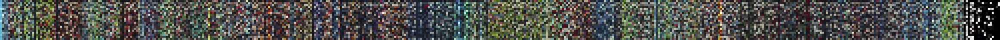
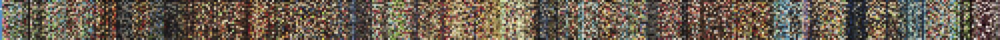
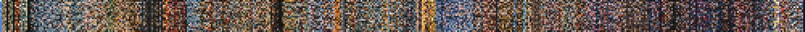
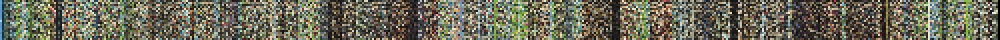
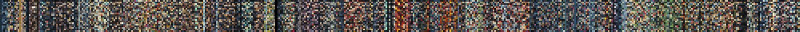

#   Movies' Color Fingerprint

These routines take a movie, and export it's color fingerpring by calculating the dominant colors present in uniformly-spaced frames across the video. They do so by splitting a movie into frames, clustering the colors in each of the frames, and plotting the most prevalent ones in a heatmap (x-axis shows time, while the y-axis shows the different clusters of colors).

**Princess Mononoke**

**Spirited Away**

**Nausicaä of the Valley of the Wind**

**The Wind Rises**

**Castle in the Sky**

##  Instructions

For now, generating the fingerprint is a somewhat convoluded process. I hope I have time in the near future to make it more streamlined, but for now just follow these steps:

1. Place the movie in the `./original/` folder.
2. Open [rescaleMovie.py](rescaleMovie.py) to change **filename** of the movie to analyze, along with the target **resolution** for downscaling (640x320 is recommended).
3. Run [rescaleMovie.py](rescaleMovie.py). This will create a new video file in the `./rescaled/` folder with a downscaled version of the movie.
4. Open [exportFrames.py](exportFrames.py) and change the **movie name**, along with the **number of frames** to split to (500 is recommended).
5. Run [exportFrames.py](exportFrames.py). This will export the still images into the  `./frames/` folder.
6. Open [fingerprint.py](fingerprint.py) and change the **frames root name**, the number of desired **dominant colors** (10 to 20 are recommended), and the **DPI** for the fingerprint file.
7. Run [fingerprint.py](fingerprint.py). The heatmaps will be in the `./fingerprint/` folder!

##  Requirements and Dependencies

[ffmpeg](https://ffmpeg.org/), [ffmpeg-python](https://pypi.org/project/ffmpeg-python/), [scikit-learn](https://scikit-learn.org/), [matplotlib](https://matplotlib.org/)

## Author

 

[Héctor M. Sánchez C.](https://chipdelmal.github.io/)
